# 基于Springboot的汽车票网上预订系统

## Springboot-0077


## 技术栈

Springboot mybatisplus vue mysql maven


## 数据库表(11张)


## 功能介绍

```properties
管理员功能有个人中心，用户管理，汽车票管理，订单管理，退票管理，换票管理，反馈管理，留言板管理，系统管理等。

用户功能有个人中心，汽车票管理，订单管理，退票管理，换票管理，反馈管理等。
```


## 图片

### 前台


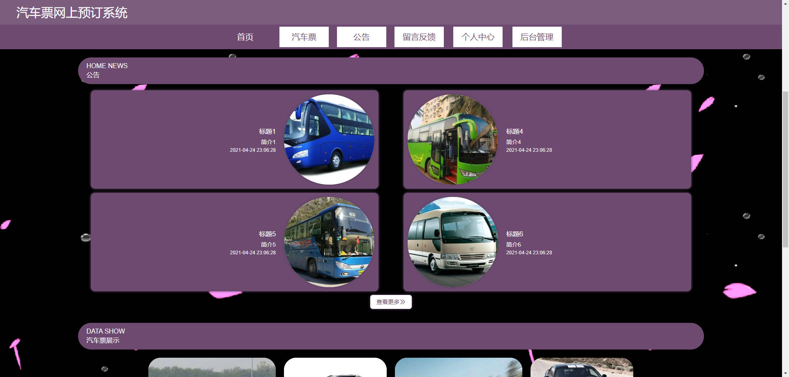


!(./images/3.jpg)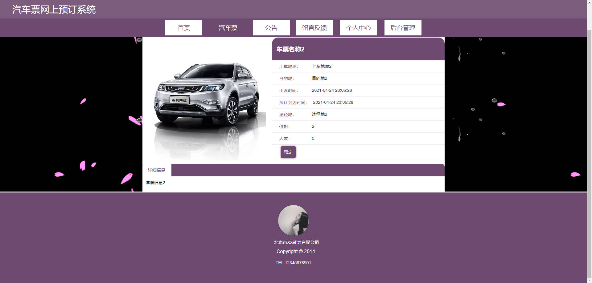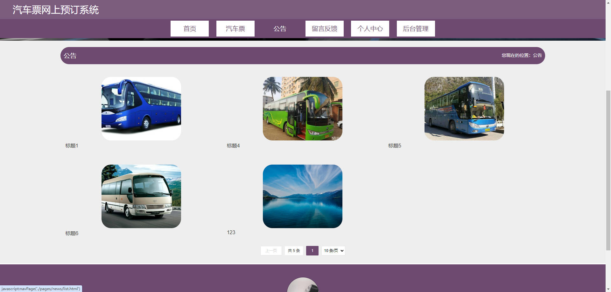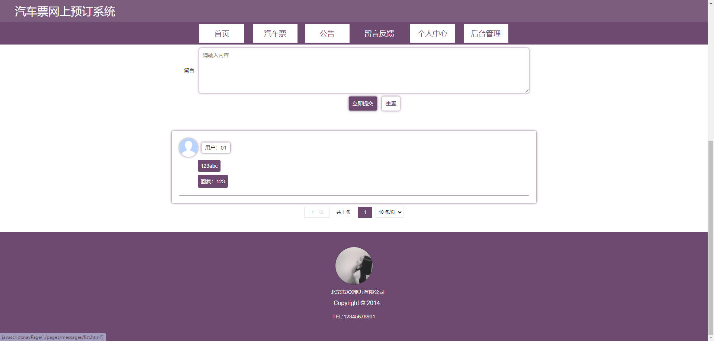

### 后台


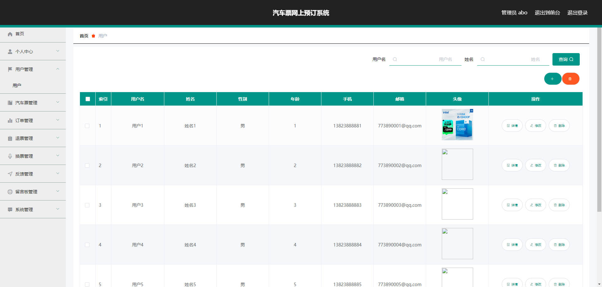

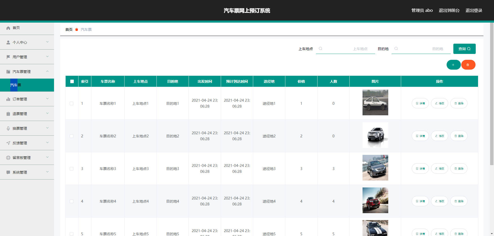

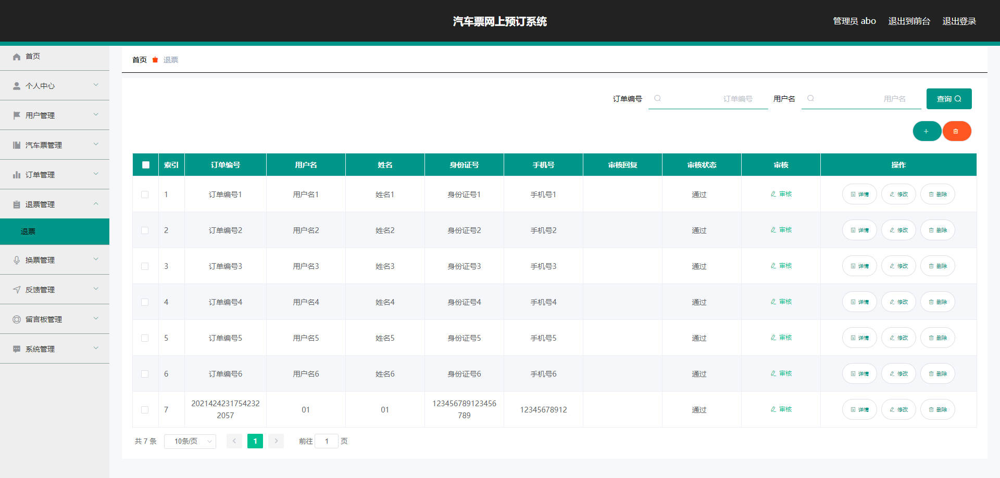

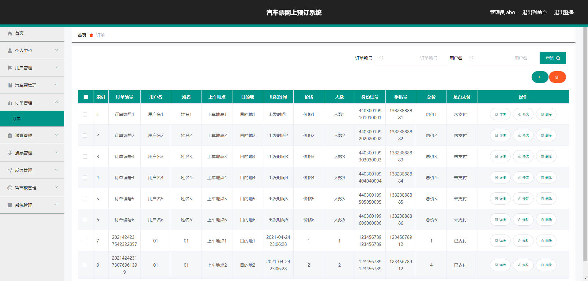

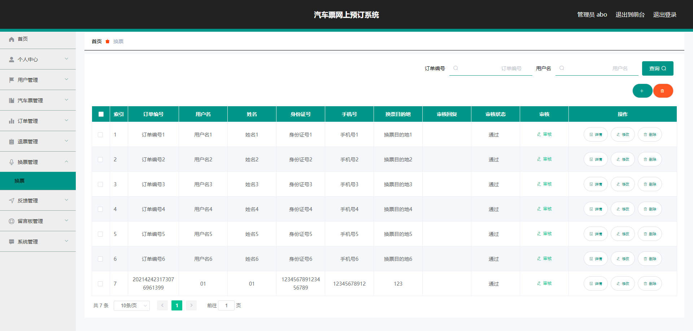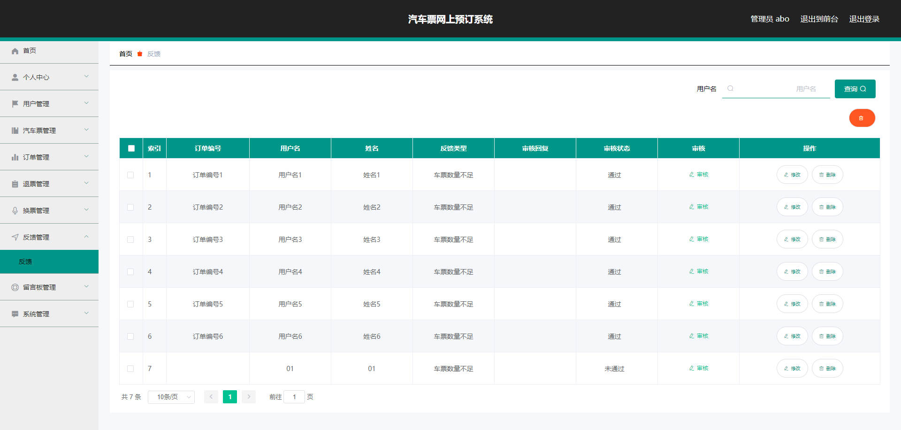


## 访问路径

### 前台

```properties
http://localhost:8080/springboot0t1t7/front/pages/login/login.html

账号 01
密码 01
```

### 后台

```properties
http://localhost:8080/springboot0t1t7/admin/dist/index.html#/login

账号 abo
密码 abo
```


## 功能图

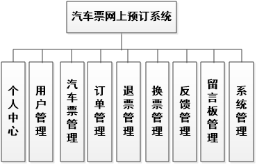


## 文档目录

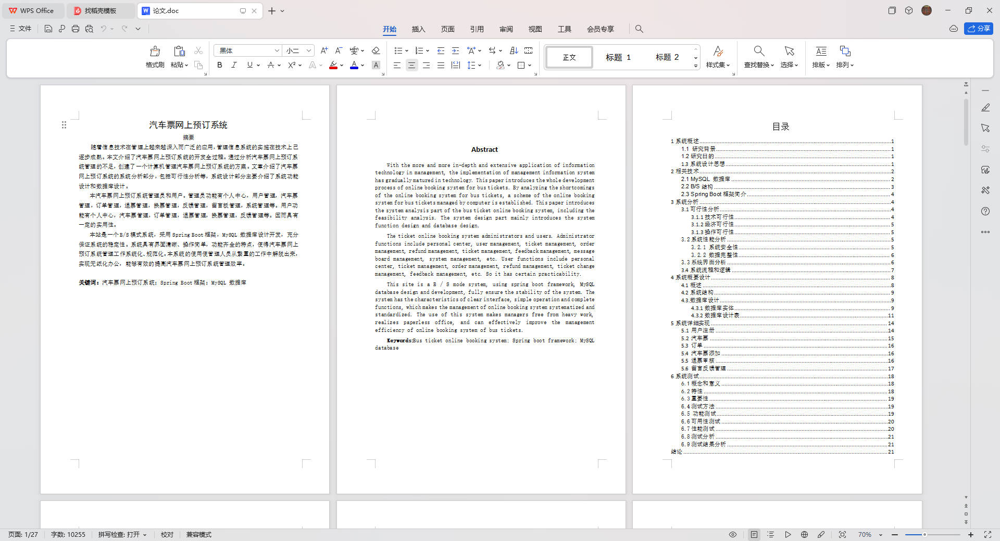


## 打赏或交流


